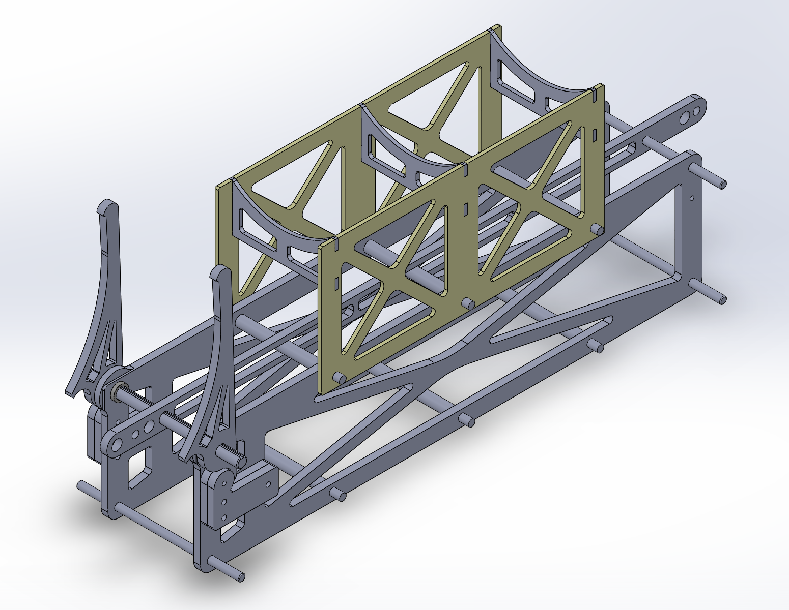
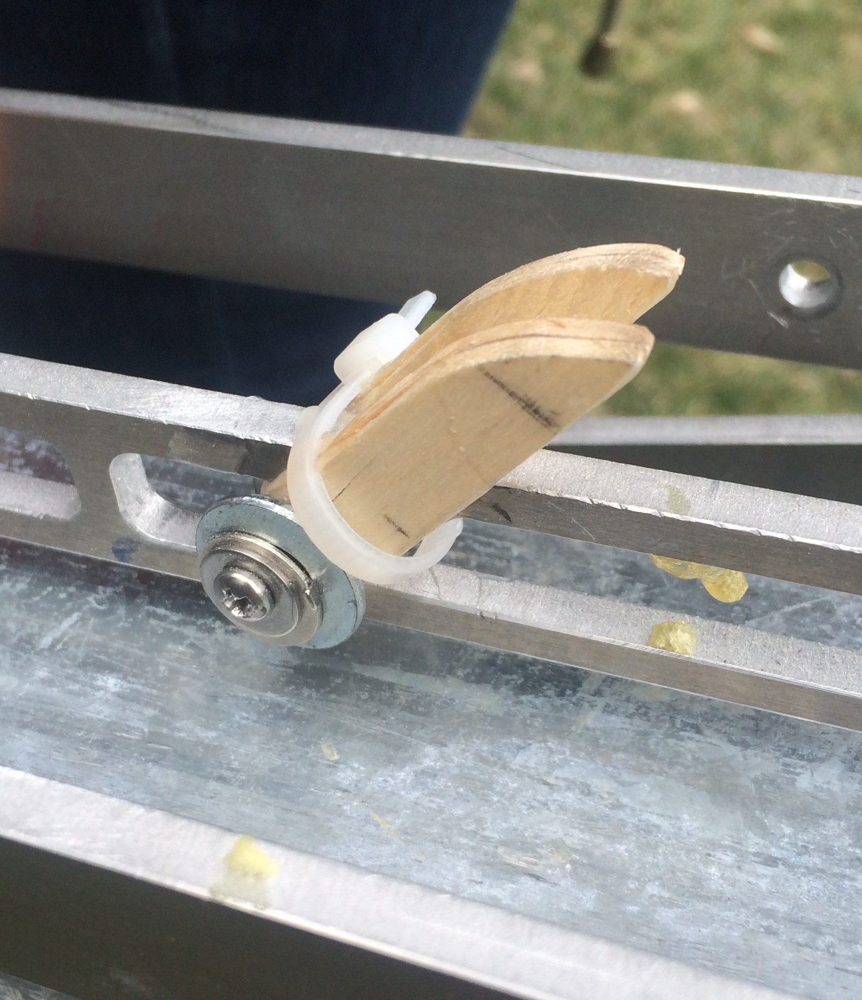
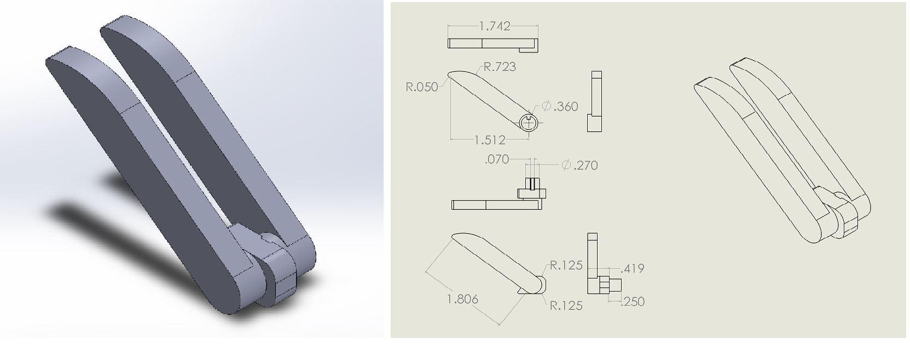

Catapult
=========

.. contents::

Overview
---------

The catapult cart is the direct interface between the catapult and the aircraft and is critical for a successful takeoff.

The cart is composed mainly of 3/16” aluminum sheet metal which has been water-jet cut to shape. The geometry of the cart adds strength in the needed locations while keeping mass to a minimum. Two identical side plates serve as the primary mounting surfaces for the cart's various interfaces as well as large stopping bloacks that contact the frame damper springs and distribute the loads present during deceleraion. Four shafts contain a total of eight wheels that ride along the corners of the frame. An additional piece known as the pin tension member spans the top two shafts. A carabiner connects this member to the cable at the front of the cart. At the back of the pin tension member is a hole that interfaces with the safety pin.

The cart frame experiences its highest loading upon impact with the spring stoppers. It must decelerate from 15 m/s to rest in about 5.7 cm. This is a deceleration of approximately 200 G. Since all of the force of the deceleration is applied to the stopping blocks, they have to sustain an average force of approximately 1000 N (225 lb) each. Thus, ensuring that the cart's connections fully constrain the aircraft from undesired motion is a high priority in all present and future design changes.

Icarus / Eos Interface
-----------------------

The original design of the cart was created for Eos. Its interface comprises of four arms fit to the top two shafts in the cart. The front two arms are connected to a ratcheting mechanism that constrain them in place until the cart reaches the end of its track, restraining the plane in place as the throttle is applied. At the end of the track, the ratchet is released and the arms pivot about the cart shafts. During launch, they exert a force on the plane at their tips. The moment created by the force of the plane is balanced with the use of four rubber bumpers mounted to the cart walls. Upon impacting the damping springs, the arms rock forward and bounce off the bumpers, allowing them to gently come to rest.

In its final iteration, the cart was 1.0 kg and 12.5" in length.

The interface between the arms and the plane was designed to lock into the plane during acceleration and slide away during detachment. All four arm tips fit into small holes cut into the bottom of the plane. Icarus was designed with a Kevlar fuselage embedded with high-strength garolite plates laser-cut to conform with the arms of the cart. During acceleration, the plane has a tendency to pitch up since the horizontal forces are being applied below the center of mass. To prevent this pitching response, the front two arms feature small hooks that grip the fuselage skin. The back arms only require small nubs that interface with the fuselage holes since the pitching tendency acts to push them further into the holes. Upon detachment, the arms pivot out of the holes and the plane continues in straight-line motion.

Odysseus Interface v1.0
-------------------

.. image:: images/odysseus_cart.png
	:align: center

The interface designed for Odysseus required significant modification to the existing Eos cart design. While existing mechanisms like the fitted launch arms and the pin tension member were retained, new mechanisms such as the cradle were introduced to the cart in this iteration.

Foremost, the cart's side plates and the pin tension member were extended to 18.5" in length. Additional changes made to the weight reduction design for three holes, the back two 0.375" in diameter and the front 0.19" in diameter, on the top side of each side plate. These holes were included to attach the cradle as well as facilitate future interface designs as needed.

The cradle provides a surface that is stable enough to constrain the aircraft during acceleration while smooth enough to allow for clear removal from the cart. It is comprised of two side plates, three ribs, and a polycarbonate cover. Each rib pieces into the side plates and is held in place by the side plate's connection to the three mounting holes on the cart itself. These plates are bolted through 4 18-8 machine screws in each of the back two holes and a 8-32 machine screw in each front hole. The polycarbonate cover is attached to the upper surface of the finished cradle assembly via wet cement or gorilla glue.

Odysseus Interface v1.1
---------------------

As of May 2016, significant modifications have been made to the Odysseus interface and base cart. The thickness of the base cart's side plating, the pin member, and the front cart arms have been increased from 3/16" to 1/4". After observations of parallel plate motion in field testing, six perpendicular rods have been incorporated into the cart into to restrict parallel plate motion. The upper three of the rods have replaced the the machine screws which piece the cradle to the base cart. The stopper pieces for the front cart arms and the launch arm's springs have been merged into one piece called the stopper. Testing of these cart modifications has yet to be conducted.

Bixler Interface
-----------------

The interface developed for the Bixler 3 test plane consists of two sloped extended shafts that piece into a channel cut in the bottom of the Bixler's fuselage. Initial development consisted of two wooden tabs cut to 2.5" and sloped on their upper edge. These tabs are connected by means of an single 8-32 machine screw, locknut, and a mirrored washer arrangement threaded through the centered pin member of the cart. 

This assembly is functional in securing the Bixler to the catapult throughout launch; however, several improvements are needed for further use. Issues that have arisen in testing thus far include: failure to constrain lateral motion, excessive tearing of the Bixler's fuselage, and complete mechanical failure. Foremost, 3D printing of the functional assembly into a single or two interlocking parts has been explored and should be fabricated for future use. Conceptual CAD schematics for a new Bixler interface are pictured below and are available on the Mechanical Subteam's Cornell Box.

Control
-------
