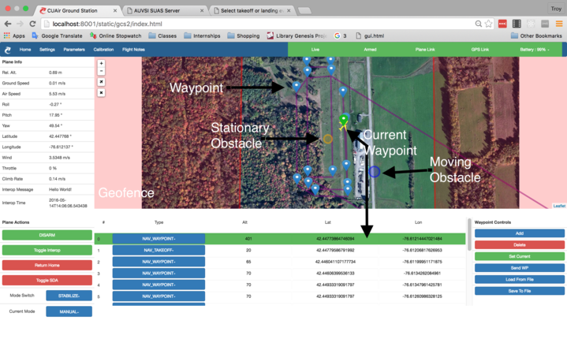

Ground Station
===============

.. contents::

This section describes the use and design of the autopilot ground station

Overview
--------

We use a terminal-based ground station software called `MAVProxy <http://dronecode.github.io/MAVProxy/html/index.html>`_ that receives data from and sends data to the plane via a radio and antenna connected to a computer via USB and the plane. MAVProxy receives telemetry data and other data from the plane, and is able to control the plane by setting up a mission, changing parameters, arming and disarming the plane, and more. We've customized it to do a few mission-specific things like interoperability, SDA, and more.

Probably the biggest custom feature is the browser-based front end to MAVProxy for easy and intuitive control of the plane. MAVProxy now provides a REST API that the front end queries to receive data and control the plane. This front end provides a GUI to perform the majority of tasks that MAVProxy can do, and see the data from the plane in a user-friendly layout.

Installation
-------------
1. git clone https://github.com/CUAir/MAVProxy.git
2. On Linux:

  1. sh setup.sh
  2. pip install python-dev pymavlink tornado requests_futures requests flask sympy

2. On Mac:

  1. cd MAVProxy/MAVProxy
  2. virtualenv venv
  3. source venv/bin/active (try venv/bin/activate if that doesn't work)
  4. pip install pyserial matplotlib Pillow numpy pyparsing python-dev pymavlink tornado requests_futures requests flask sympy
  5. `Install OpenCV <http://jjyap.wordpress.com/2014/05/24/installing-opencv-2-4-9-on-mac-osx-with-python-support/>`_

To edit the front-end:

1. Install Node/NPM: https://nodejs.org/en/download/
2. cd MAVProxy
3. npm install -g gulp
4. cd MAVProxy/modules/server/static/gcs2
5. npm install
6. gulp

Setup with plane
-----------------

Linux:

1. Run the command ::

	cd MAVProxy/MAVProxy

2. Next, run ::

	python mavproxy.py --master=/dev/ttyUSB<X> --baudrate=57600

* Run ls /dev/ to see what X should be - also could by TTYACM<X>
* If you can't find anything, open mission planner and it should show the appropriate path in the upper right
* If using MAVProxy through wired micro-USB rather than wireless, baudrate should be 115200

Mac:

1. Run the command ::

	cd MAVProxy/MAVProxy

2. Next, run ::

	python mavproxy.py --master=/dev/tty.usb<tab complete> --baudrate=57600

* Run ls /dev/ if tab completion doesn't work
* If you can't find anything, open mission planner and it should show the appropriate path in the upper right
* If using MAVProxy through wired micro-USB rather than wireless, baudrate should be 115200

Setup with SITL
---------------

The Software in the Loop is a simulation of ArduPilot with FlightGear. This can be used as a virtual environment to test changes without needing a physical plane.

Use:

1. Connect to RedRover or EduRoam

	* There is a VPN to connect from elsewhere, but it's usually too slow to make work. Ask if you want to set it up, but at that point you may want to just install the SITL on your personal computer (`Linux instructions <http://ardupilot.org/dev/docs/setting-up-sitl-on-linux.html>`_, `Windows Instructions <http://ardupilot.org/dev/docs/sitl-native-on-windows.html>`_)

2. ssh into the computer running the SITL. The IP address may be out of date - see Troy for an updated version ::
	
	ssh -Y cuair@10.145.14.217

3. Run ::

	cd /Users/cuair/src

4. Run 'vagrant up' to confirm that the virtualbox running the autopilot is active ::

	vagrant up

5. It's likely that flightgear is already running on the server. If these next steps fail, then open a separate terminal window and run the following commands to start it ::

	cd ardupilot/Tools/autotest
	sh sim_fg_host.sh

6. ssh into the virtual machine running the autopilot ::

	vagrant ssh

7. Finally, start the SITL ::

	sim_FG.sh

8. You should see two X11 windows pop up on your computer. This may take up to a few minutes to happen.
9. To run the ground station, in a separate terminal window from the MAVProxy/MAVProxy directory, start MAVProxy ::

	python mavproxy.py --master=tcp:10.145.14.217:5555

Autopilot Server on the NUC
---------------------------

The autopilot sever on the NUK provides an API for distributed to access autopilot data.

::

  ------  --(telem2 fdti)--> AutoPilot NUC server ----------> distributed
  Plane |      
  ------  <----(RFD900)----> AutoPilot Ground Server <------> AutoPilot Ground Station

To install, connect to the NUC and connect the NUC to the Internet. Then, ::
  
  git clone https://github.com/CUAir/MAVProxy
  git checkut airapi
  cd MAVProxy/MAVProxy
  virtualenv venv
  source venv/bin/activate
  pip install -r requirements.txt

To start the server, run ::
  
  cd MAVProxy/MAVProxy
  source venv/bin/activate
  python mavproxy.py --master=/dev/ttyUSB0

**NOTE:** The serial port is not bound to ttyUSB0. Sometimes you will have to try ttyUSB1 or ttyUSB2

How the front-end works
------------------------

Setup
^^^^^^

To use:

  Once MAVProxy is running, go to http://localhost:8001/static/gcs2/index.html

  The judge's view can be found at http://localhost:8001/static/judges/index.html

Usage instructions
^^^^^^^^^^^^^^^^^^^
The home screen has all of the flight information and flight controls used in normal operation of the ground station. The map displays the waypoints shown below it and the map can be changed in the settings tab. Additionally, the settings tab contains settings for the interop server, authentication information, geofences andthe reboot control (which requires double-confirmation). The parameters tab contains all of the parameter information. Grey parameters indicate that those parameters haven't been received yet. The calibration tab allows accelerometer, gyroscope and pressure (airspeed) calibration. Finally, the Flight Notes tab can be used to store information. The Flight notes store your notes locally to your browser using localStorage (basically cookies) so they will not transfer between computers.

The stack
^^^^^^^^^^
Our stack consists of python (MAVProxy & Flask) on the backend with React, Flux, Sass, gulp and Jade being used on the front-end. Additionally, our backend can technically serve information over a rest API as well as over websockets, however websockets tended to be pretty buggy so we decided to switch back to only using the REST API.

React
^^^^^^
The front-end (gcs2) is built in React, a javascript library from Facebook that makes the front-end faster by diff-ing the current DOM with the new state to reduce the number of DOM operations (which are very expensive) and rendering changes to the front-end in real-time. `See the documentation for the React here <https://facebook.github.io/react/docs/getting-started.html>`_. 

Flux
^^^^^
To power our react system, we used vanilla `Flux <https://facebook.github.io/flux/docs/overview.html>`_ which is powered through a system called action-store-dispatcher that makes all changes 1-way interactions (rather than Angular's 2-way bindings). We broke the application down into essentially 8 sections: Calibration, Geofences, Interoperability, Parameters, SDA, Settings, Plane Status, and Waypoints. Each section has it's own action creator and store. For an example of how to use React with Flux, `this <https://github.com/facebook/flux/tree/master/examples/flux-chat/>`_ is simple but extremely useful. You should either read it through in its entirety or try to make it/mess with it to get familiar. Once you understand the general code structure, it shouldn't be hard to get the hang over making a simple app. One of the benefits of Flux over other javascript frameworks like Angular is that since everything is 1-way, the stack traces are very clear, which assists in debugging. One of the downsides of Flux is that it requires a bit of boilerplate code/scaffolding. We may switch to redux instead of flux at some point, but we want to get to know that framework better before commiting to doing so.

.. image:: images/flux.png

Leaflet.js
^^^^^^^^^^^
To handle our maps, we use Leaflet.js, a leading mobile-compatible open source mapping library. All of the map functions get handled in MapUtils.js and handles waypoints, obstacles, plane-tracking, geofences and locations. The plane has an icon and there is a marker icon for each waypoint. Additionally obstacles and geofences are treated as shapes and locations are set in settings.

Parameters
^^^^^^^^^^^
To generate the parameters list, we have a python/bash script that pulls the parameters from the ardupilot website (in the documentation folder), parses them from xml, removes extraneous characters, converts them to json, and copies them to a javascript file (ParamDocumentation.js) so the object can be loaded in as json.

Bootstrap
^^^^^^^^^^
Additionally, for our visual library we used `Twitter's Bootstrap <http://getbootstrap.com/>`_ because it is ubiquitous on the internet, it has an enormous community, and it is has a very appealing UI. 

Testing
^^^^^^^^
The ground station has 2 primary tests: front-end tests and backend tests. The front-end uses selenium tests which get run by going to MAVProxy/MAVProxy/modules/server/static/gcs2/test and running python test.py (run setup.sh the first time before running test.py) which runs front-end selenium tests. The backend tests are run by going to MAVProxy/MAVProxy/modules/server and running python tests.py which uses the requests module to test the REST API. We plan on adding these tests to our CI server next semsester once we get CI set up.

Communications
^^^^^^^^^^^^^^^
Our front-end system uses a simple polling system (in ReceiveApi.js). We originally used socket.io with websockets, but it was way too slow (may be a result of synchronous socket emits, not entirely sure). Basically we just take advantage of the REST API implemented in flask on the back-end. We use post/delete/put requests to send information to the server. All non-GET requests are protected with a token/password and all highly vulnerable actions (i.e. reboot) are protected with an extra layer of checks and a second confirm element in the request.

Interoperability
------------------

Setup
^^^^^^^^

`See the Judge's server interoperability documentation here. <http://auvsi-suas-competition-interoperability-system.readthedocs.io/en/latest/>`_

Interoperability Use
^^^^^^^^^^^^^^^^^^^^^

General Test Flight Use
************************

1. Make sure to bring a computer with the interop server installed on it. If possible, have a template mission ready to got

2. cd interop/setup and run vagrant up to start the server
    
    * The server will run on localhost:8000

3. To load the template mission:
    
    a. vagrant ssh
    b. cd interop/server
    c. source venv/bin/activate
    d. python manage.py flush (This will flush the database - do not do this if you want to keep the current database - see below for storing a dump)
    e. python manage.py loaddata template_mission.json

4. Now the mission must be set up on the interop server to match the mission in Ardupilot

    a. Go to localhost:8000/admin/
    b. Click "Mission configs"
    c. Click the first mission
    d. In "Mission Waypoints", hit the + button at the side to add a new waypoint
    e. Enter the proper order (1 indexed), then hit the spyglass then 'add aerial position'
    f. Enter the proper altitude IN FEET
    g. Hit the spyglass, then 'add gps position'
    h. Enter the proper latitude and longitude
    i. Continue starting from set e. until all waypoints are entered

5. Save the mission config
6. Go to localhost:8000 and hit "Mission 1". You should see a picture of your setup, where blue spheres are the waypoints and the rest is not relevant to navigation. Confirm that the blue spheres look like what your waypoint setup should be (If you don't see the picture, try Firefox instead of Chrome)
7. Enter the correct username, password, and url (include the http: and the port (usually 8000) in the settings tab of gcs2
    
    * This will usually be 'cuairsim' and 'aeolus' for the username/password, and "http://<some ip>:8000" for the url

8. Hit "Toggle interop".  Look at the Mission 1 again, and confirm that a yellow box appears, meaning that the interop server is receiving data

9. Hit "Toggle interop" again to turn off data sending until you're ready to fly

10. When you're ready to fly, FIRST hit 'toggle interop' on the front end to start sending data to the interop server

11. Then, go to "localhost:8000/admin/", then click "Takeoff or landing events"

12. Hit "add a takeoff or landing event", then select the appropriate user and "Uas in air". Hit save.

    * As of now the server is checking for data and recording data. Make sure the plane has data link as much as possible after this, or the avg telemetry HZ will be low

13. Fly!

14. Create a LANDING event for the appropriate user (same thing, but leave "Uas in air" unchecked)

15. Hit "Toggle interop" to stop sending data to the interop server

16. Go to the mission page and mouse over "System". Right click "Evaluate Teams (csv)" and save it as a file. Open that file in Excel or an equivalent to view the flight data (Don't try to view it as plaintext, it's doable but annoying)

17. To create a database dump, ssh in as if you were about to load a mission config (see beginning), but instead use 'python manage.py dumpdata > mydatadump.json'

MAVProxy/Ground Station use
****************************

1. Enter the correct username, password, and url (include the http: and the port (usually 8000) in the settings tab of gcs2
2. Hit "Toggle Interop" to activate server

  * You should see "interop server started" printed on the MAVProxy console and get a green success status message on the ground station

3. To stop, hit "Toggle Interop" again

  * You should see "interop server stopped" printed on the MAVProxy console and get a green success status message on the ground station

Judge's Server use
******************

  `See the Judge's server interoperability documentation here. <http://auvsi-suas-competition-interoperability-system.readthedocs.io/en/latest/>`_

Interoperability Design
^^^^^^^^^^^^^^^^^^^^^^^

System Design
*******************

The backend is designed with 3 main components - the API, which provides a REST API for the front end to control and query the backend, the backend itself, which sends information to and retrieves information from the judge's server, and the test suite, which tests the functionality of the backend.

.. image:: images/interop_flowchart.png

API
##############################################

**Location:** modules/server/views/interop_api.py

The program creates a flask server to serve data to the front end and other subteams. It retrieves data related to interoperability from the MAVProxy.modules.server.data file. It also contains an endpoint to start and stop the backend.

When multiple endpoints are listed, both are valid - the second is the newest is is preferred. Other endpoints not listed here in code are deprecated.

**Endpoints**

  * **Server Control** (/v1/interop) (/ground/api/v3/interop)
      * **POST**

        Sending a POST request to this endpoint starts the interop backend. To do this, it creates a new instance of the backend object, then starts the backend on a separate thread and sets the server to active. It will fail if the server is either already started, or if it has been less that a half second since the server was either started or stopped last. Requires a valid JSON containing the server data (username, password, and url fields). Requires a valid auth token to 

      * **DELETE**

        Sending a DELETE request to this endpoint will stop the interop backend. It simply sets the Data.server_active global variable to false. This is the loop condition on the backend, so the server will stop as soon as it completes its current loop. This will fail if the server is either already stopped or if it has been less that a half second since the server was either started or stopped last. Requires a valid auth token to access

      * **GET**

        Returns a JSON string containing the obstacle data and server info
    

  * **Obstacles** (/v1/interop/obstacles) (/ground/api/v3/interop/obstacles)

    Returns a JSON object string that contains a list of both moving and stationary objects. Checks to see if the server is active, and, if so, retrieves data from the MAVProxy.modules.server.data module, jsonifies it and returns it

  * **Server Info** (/v1/interop/server_info) (/ground/api/v3/interop/server_info)

    Returns a JSON object string that contains the server message, message timestamp, and the server time at last retrieval. Checks to see if the server is active, and, if so, retrieves data from the MAVProxy.modules.server.data module, jsonifies it and returns it.

  * **Time** (/v1/interop/time) (/ground/api/v3/interop/time)

    Returns a single string that represents the server time at last retrieval. Checks to see if the server is active, and, if so, retrieves data from the MAVProxy.modules.server.dat'a module, then returns it as a raw string

MAVProxy Backend
###################################################

**Location:** modules/server/interop.py

This program is the script that does the work of  sending telemetry data to the judge’s interoperability server and retrieving data about the server and obstacles to store for other MAVProxy modules.

**Global Variables**
  * **TRIES_BEFORE_FAILURE**

    The number of consecutive telemetry failures the system will accept before warning the user the telemetry is down. System will automatically warn the user every time a single telemetry request fails regardless, but will not display as down until reaching this cap
  * **RUN_TESTS**

    Uncomment this to run test cases. This will cause the url to be overwritten with the url used to run test cases
  * **FEET_TO_METERS_FACTOR**

    The factor to multiply a value in feet by to get a value in meters

**Methods**
    
  * **\_\_init\_\_(self)**

    Establishes a connection with the interop server and starts a session by logging in with the specified credentials. The server returns cookies after login, which are stored in the self.session variable and will be used every time a request is sent by this object
    
  * **start(self)**

    Spawns two threads that send telemetry data and retrieve server and obstacle data. After spawning, it checks every second to see if the server has stopped, and if so, prints that to the console then exits.

  * **get(self)**

    Will never be called on the main thread, this method is called as its own thread by the start method. It calculates the period (time between requests), then loops on the server_active condition. It sleeps until it is time to send a new request, sends that request, then stores the response in Data.pdata.

  * **post(self)**

    Will never be called on the main thread, this method is called as its own thread by the start method. It calculates the period (time between requests), giving it a fudge factor of 10% as it does to ensure that the average telemetry send rate stays well above the required number. It then sleeps until it is time to send a bit of data. When it is time, it grabs the necessary data from the Data.pdata object, then sends the http request to the interop server on a separate thread. This is done asynchronously so we do not have to wait for a response and can continue at the proper speed even if the server is running slowly.
      
  * **send_telemetry(self, telemetry_data)**

    Sends the telemetry data as an http request to the judge’s server. Afterwards, it checks the status of the request and increments the failures if necessary.

  * **initialize_history(self, obstacles)**

    Initializes the recorded history of obstacle data for use by SDA.
      
  * **meters_to_feet(meters)**

    Converts a float from a value in meters to a value in feet
      
  * **feet_to_meters(feet)**

    Converts a float from a value in feet to a value in meters

Test Suite
###############

**Location:** /modules/server/interop_test_cases.py

This is the test suite that is used for testing the interop backend. It simulates the judge’s interoperability server on the machine, serves up simulated server data and obstacles, and accepts telemetry requests. It then performs a number of tests to ensure that the data was received and store properly, and the the telemetry data received is formatted correctly and being sent quickly enough.

**Running the test suite**

1. In the backend (/modules/server/interop.py), set RUN_TESTS to True
2. In the API (modules/server/views/interop_api.py), set RUN_TESTS to True
3. Run MAVProxy normally, then from the front end hit “toggle interop”
4. Review console printout (should take about 100 seconds to run to completion)

  * Upon completion, type ‘reset’ to fix the console.

Competition rules
**********************

Below are the rules that govern interoperability for the competition. The interoperability system is made to comply with these rules.

**5.3.1.** As a flight‐mission demonstration requirement, teams shall upload the UAS autopilot telemetry (TM) data (position, altitude, and related attributes) to support scoring using the interoperability system

    **5.3.1.3.** If the team's system cannot provide TM data to the judges using the interoperability system they will not be allowed to fly ‐ just like if they had not displays to show the judges' the air vehicles position. 

**5.3.2.** The UAS shall upload this TM data at a target rate of 10Hz from the first takeoff until the last landing.  If the average rate of upload across all flight periods is below 8 Hz, the team will receive no points for the mission demonstration.  The difference between 10 Hz and 8 Hz is intended to allow for short and temporary data link outages. 

**5.3.3.** Data dropouts, which impact the ability for the judges to use the telemetry data to judge mission components, will be counted against the team.  For example, if data dropout makes it unclear whether waypoints were captured within 50ft and in order, it will be assumed the team did not do so. If the data dropout occurs near a flight zone boundary, it will be assumed the team spent the entire time out of bounds.  If the data dropout occurs near obstacles, it will be assumed those obstacles were hit.  For data dropout evaluation, it will be assumed the UAS traveled at the maximum allowed competition airspeed (100 KIAS). 

**5.3.4.** The UAS may upload the position whenever the interoperability network is available, and is not restricted to airborne flight periods.  Teams should also upload position whenever the UAS occupies the runway. 

**5.3.5.** Data uploaded shall be genuine autopilot flight telemetry data which is not interpolated, extrapolated, duplicated, simulated, or otherwise edited by team's code/operators before being passed to the interoperability system.  The data must be generated by the autopilot at 10Hz, or greater, and thus the UAS will need sensors and data links which can support sufficient data rates.

**7.9.6.** Display Obstacles.  There are virtual obstacles for the Sense, Detect, and Avoid (SDA) task.  The positions and sizes of the obstacles are provided by the interoperability server.  This information shall be downloaded and displayed at the same UAS autopilot operator interface (e.g. the same laptop), used in the Ground Control Station.  These obstacles shall be displayed in a view that also shows the UAS position, the mission boundaries, the task positions, and the UAS’ waypoints.   This view does not need to be the autopilot interface (e.g. the desktop application)
