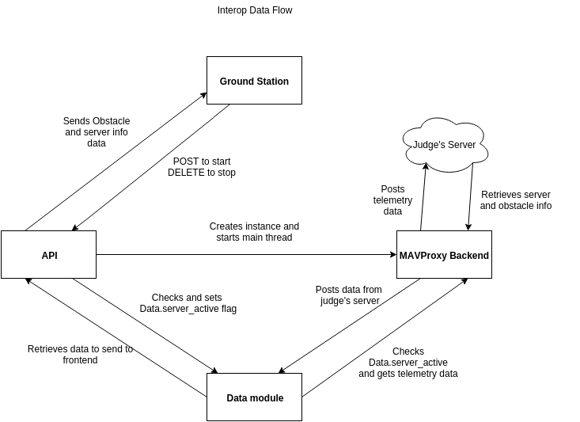

.. CUAir Autopilot Documentation documentation master file, created by
   sphinx-quickstart on Mon May  2 11:28:43 2016.
   You can adapt this file completely to your liking, but it should at least
   contain the root `toctree` directive.

<<<<<<< HEAD
Autopilot API endpoints
============================

The API for communicating between the autopilot and the ground station.

Status [/status]
----------------

Get the status of the plane: A large json containing each piece of data as a name/value pair. A call can also be made to /status/... to receive an
individual bit of data (below)::

  Response 200 (application/json)
        {
            "attitude" : {
                "pitch" : 0.0,
                "yaw" : 0.0,
                "roll" : 0.0,
                "pitchspeed" : 0.0,
                "yawspeed" : 0.0,
                "rollspeed" : 0.0
                },
            "battery" : {
                "pct" : 0.0,
                "voltage" : 0.0
                },
                
            "link" : {
                "gps_link" : "True",
                "plane_link" : "True"
                },
            
            "time" : 0,
            
            "gps" : {
                "rel_alt" : 0.0,
                "asl_alt" : 0.0,
                "lat" : 0.0,
                "lon" : 0.0,
                "heading" : 0.0,
                "vx" : 0.0,
                "vy" : 0.0,
                "vz" : 0.0
            },
            "mode": "AUTO",
            "airspeed" : {
                "vx" : 0.0,
                "vy" : 0.0,
                "vz" : 0.0
            },
            
            "wind" : {
                "vx" : 0.0,
                "vy" : 0.0,
                "vz" : 0.0
            },
            
            "throttle" : 0,
            
            "waypoints" : [{
                "alt" : 0.0,
                "lon" : 0.0,
                "lat" : 0.0
            }],
            
            "wp_count" : 0,
            "current_wp" : 0,
            "geofences" :  [{
                "lat" : 0.0,
                "lon" : 0.0
            }],
            "hud" : {
            "airspeed" : 0.0,
            "groudspeed": 0.0,
            "heading": 0,
            "throttle": 0,
            "alt": 0.0,
            "climb": 0.0
            }
        }

Attitude [/status/attitude]
^^^^^^^^^^^^^^^^^^^^^^^^^^^^^^^^^^^^^^^^^^^^^^^^
Returns the plane's attitude, containing:

* Pitch [float]
* Yaw [float]
* Roll [float]
* Pitchspeed [float]
* Yawspeed [float]
* Rollspeed [float]

::

  + Response 200 (application/json)
  { 
     "pitch" : 0.0,
     "yaw" : 0.0,
     "roll" : 0.0,
     "pitchspeed" : 0.0,
     "yawspeed" : 0.0,
     "rollspeed" : 0.0,
   }

Battery [/status/battery]
^^^^^^^^^^^^^^^^^^^^^^^^^^^^^^^^^^^^^^^^^^^^^^^^

Returns the current state of the plane's battery, containing:

* pct [float]
* voltage [float]

::

 + Response 200 (application/json)
        {
            "pct" : 0.0,
            "voltage" : 0.0,
        }
        
Link [/status/link]
^^^^^^^^^^^^^^^^^^^^^

Returns the status of links, containing:

* gps_link [boolean]
* plane_link [boolean]

::

 + Response 200 (application/json)
        {
            "gps_link" : "True",
            "plane_link" : "True",
        }
        
Time [/status/time]
^^^^^^^^^^^^^^^^^^^^^^^^^^^^^^^^^^^^^^^^^^^^^^^^

Returns the current time as an long representing a [unix timestamp](https://en.wikipedia.org/wiki/Unix_time) 

::

  + Response 200 (application/json)
        {
           0
        }
        
GPS [/status/gps]
^^^^^^^^^^^^^^^^^^^^^^^^

Returns various values from the plane's onboard GPS, containing:

* rel_alt [float]
* asl_alt [float]
* lat [float]
* lon [float]
* heading [float]
* vx [float]
* vy [float]
* vz [float]

::

  + Response 200 (application/json)
        {
            "rel_alt" : 0.0,
            "asl_alt" : 0.0,
            "lat" : 0.0,
            "lon" : 0.0,
            "heading" : 0.0,
            "vx" : 0.0,
            "vy" : 0.0,
            "vz" : 0.0,
        }
        
Mode [/status/mode]
^^^^^^^^^^^^^^^^^^^^^^^^^^^^^^^^^^^^^^^^^^^^^^^^

Returns the current flying mode of the plane as a string, e.g. "AUTO", "MANUAL", "FLY_BY_WIRE_A"

::

 Response 200 (application/json)
        {
           "AUTO"
        }
        
Airspeed [/status/airspeed]
^^^^^^^^^^^^^^^^^^^^^^^^^^^^^^^^^^^^^^^^^^^^^^^^

Returns vectors vx, vy, vz representing the airspeed velocity of the airplane as floats

::

 + Response 200 (application/json)
        {
            "vx" : 0.0,
            "vy" : 0.0,
            "vz" : 0.0
        }

Wind [/status/wind]
^^^^^^^^^^^^^^^^^^^^^^^^^^^^^^^^^^^^^^^^^^^^^^^^

Returns vectors vx, vy, vz representing the wind velocity vector as floats

::

 Response 200 (application/json)
        {
            "vx" : 0.0,
            "vy" : 0.0,
            "vz" : 0.0
        }    
        
Throttle [/status/throttle]
^^^^^^^^^^^^^^^^^^^^^^^^^^^^^^^^^^^^^^^^^^^^^^^^

An integer from 0 to 100 representing the current throttle level of the plane

::

 Response 200 (application/json)
        {
            0
        }
        
Waypoints [/status/waypoints]
^^^^^^^^^^^^^^^^^^^^^^^^^^^^^^^^^^^^^^^^^^^^^^^^

Returns a list of JSON objects representing the current waypoints altitude, latitude, and longitude

::

 + Response 200 (application/json)
        [{
                "alt" : 0.0,
                "lon" : 0.0,
                "lat" : 0.0,
        }]
        
Waypoint Count [/status/wp_count]
^^^^^^^^^^^^^^^^^^^^^^^^^^^^^^^^^^^^^^^^^^^^^^^^

Returns an integer representing the current number of waypoints

::

 + Response 200 (application/json)
        {
            0
        }
        
Current Waypoint [/status/current_wp]
^^^^^^^^^^^^^^^^^^^^^^^^^^^^^^^^^^^^^^^^^^^^^^^^

Returns an integer representing the current waypoint

::

 + Response 200 (application/json)

        {
            0
        }
        
Geofence [/status/geofences]
^^^^^^^^^^^^^^^^^^^^^^^^^^^^^^^^^^^^^^^^^^^^^^^^

Returns a list of JSON objects representing the latitude and longitude of the geofences

:: 

 Response 200 (application/json)
        [{
            "lat" : 0.0,
            "lon" : 0.0,
        }]

HUD [/status/hud]
^^^^^^^^^^^^^^^^^^^^^^^^^^^^^^^^^^^^^^^^^^^^^^^^

Returns a list of values needed for the HUD, containing,

* airspeed [float]
* groundspeed [float]
* heading [integer]
* throttle [integer]
* alt [float]
* climb [float]

:: 

 Response 200 (application/json)
        {
            "airspeed" : 0.0,
            "groudspeed": 0.0,
            "heading": 0,
            "throttle": 0,
            "alt": 0.0,
            "climb": 0.0
        }

Software Status [/status/softstatus?time=TIME]
^^^^^^^^^^^^^^^^^^^^^^^^^^^^^^^^^^^^^^^^^^^^^^^^

Use the GET argument "time" (/status/softstatus?time=TIME) to request a status at a specific time. If an exact value is not available, an interoplated value will be provided.

::

 Response 200 (application/json)
        {      
        attitude: {
            'roll': 0,
            'pitch': 0,
            'yaw': 0,
            'rollspeed': 0,
            'yawspeed': 0,
            'pitchspeed': 0
            
        },
        gps:{
             lat: 0,
             lon: 0,
             asl_alt: 0,
             vx: 0,
             vy: 0,
             vz: 0,
             heading: 0,
             rel_alt: 0
         },
         airspeed:{
             'vx': 0,
             'vy': 0,
             'vz': 0
         },
         wind: {
             'vx': 0,
             'vy': 0,
             'vz': 0
         }

=======
>>>>>>> c25dde23a4f9ddcb721991222cd74831b897c3be
Ground Station
===============

This section describes the use and design of the autopilot ground station

Installation
-------------

Setup with plane
-----------------

Setup with SITL
----------------

Using the front end
--------------------

Interoperability
------------------

Setup
^^^^^^^^

`See the Judge's server interoperability documentation here. <http://auvsi-suas-competition-interoperability-system.readthedocs.io/en/latest/>`_

Interoperability Use
^^^^^^^^^^^^^^^^^^^^^

MAVProxy/Ground Station use
****************************

1. Enter the correct username, password, and url (include the http: and the port (usually 8000) in the settings tab of gcs2
2. Hit "Toggle Interop" to activate server
  * You should see "interop server started" printed on the MAVProxy console and get a green success status message on the ground station
3. To stop, hit "Toggle Interop" again
  * You should see "interop server stopped" printed on the MAVProxy console and get a green success status message on the ground station

Judge's Server use
******************

  `See the Judge's server interoperability documentation here. <http://auvsi-suas-competition-interoperability-system.readthedocs.io/en/latest/>`_

Interoperability Design
^^^^^^^^^^^^^^^^^^^^^^^

System Design
*******************

The backend is designed with 3 main components - the API, which provides a REST API for the front end to control and query the backend, the backend itself, which sends information to and retrieves information from the judge's server, and the test suite, which tests the functionality of the backend.

API
##############################################

  **Location:** modules/server/views/interop_api.py

  The program creates a flask server to serve data to the front end and other subteams. It retrieves data related to interoperability from the MAVProxy.modules.server.data file. It also contains an endpoint to start and stop the backend.
  
  When multiple endpoints are listed, both are valid - the second is the newest is is preferred. Other endpoints not listed here in code are deprecated.
  
  **Endpoints**

    * **Server Control** (/v1/interop) (/ground/api/v3/interop)
        * **POST**

          Sending a POST request to this endpoint starts the interop backend. To do this, it creates a new instance of the backend object, then starts the backend on a separate thread and sets the server to active. It will fail if the server is either already started, or if it has been less that a half second since the server was either started or stopped last. Requires a valid JSON containing the server data (username, password, and url fields). Requires a valid auth token to 

        * **DELETE**

          Sending a DELETE request to this endpoint will stop the interop backend. It simply sets the Data.server_active global variable to false. This is the loop condition on the backend, so the server will stop as soon as it completes its current loop. This will fail if the server is either already stopped or if it has been less that a half second since the server was either started or stopped last. Requires a valid auth token to access

        * **GET**

          Returns a JSON string containing the obstacle data and server info
      

    * **Obstacles** (/v1/interop/obstacles) (/ground/api/v3/interop/obstacles)

      Returns a JSON object string that contains a list of both moving and stationary objects. Checks to see if the server is active, and, if so, retrieves data from the MAVProxy.modules.server.data module, jsonifies it and returns it

    * **Server Info** (/v1/interop/server_info) (/ground/api/v3/interop/server_info)

      Returns a JSON object string that contains the server message, message timestamp, and the server time at last retrieval. Checks to see if the server is active, and, if so, retrieves data from the MAVProxy.modules.server.data module, jsonifies it and returns it.

    * **Time** (/v1/interop/time) (/ground/api/v3/interop/time)

      Returns a single string that represents the server time at last retrieval. Checks to see if the server is active, and, if so, retrieves data from the MAVProxy.modules.server.dat'a module, then returns it as a raw string

MAVProxy Backend
###################################################

  **Location:** modules/server/interop.py

  This program is the script that does the work of  sending telemetry data to the judge’s interoperability server and retrieving data about the server and obstacles to store for other MAVProxy modules.

  **Global Variables**
    * **TRIES_BEFORE_FAILURE**

      The number of consecutive telemetry failures the system will accept before warning the user the telemetry is down. System will automatically warn the user every time a single telemetry request fails regardless, but will not display as down until reaching this cap
    * **RUN_TESTS**

      Uncomment this to run test cases. This will cause the url to be overwritten with the url used to run test cases
    * **FEET_TO_METERS_FACTOR**

      The factor to multiply a value in feet by to get a value in meters

  **Methods**
      
  * **\_\_init\_\_(self)**

    Establishes a connection with the interop server and starts a session by logging in with the specified credentials. The server returns cookies after login, which are stored in the self.session variable and will be used every time a request is sent by this object
    
  * **start(self)**

    Spawns two threads that send telemetry data and retrieve server and obstacle data. After spawning, it checks every second to see if the server has stopped, and if so, prints that to the console then exits.

  * **get(self)**

    Will never be called on the main thread, this method is called as its own thread by the start method. It calculates the period (time between requests), then loops on the server_active condition. It sleeps until it is time to send a new request, sends that request, then stores the response in Data.pdata.

  * **post(self)**

    Will never be called on the main thread, this method is called as its own thread by the start method. It calculates the period (time between requests), giving it a fudge factor of 10% as it does to ensure that the average telemetry send rate stays well above the required number. It then sleeps until it is time to send a bit of data. When it is time, it grabs the necessary data from the Data.pdata object, then sends the http request to the interop server on a separate thread. This is done asynchronously so we do not have to wait for a response and can continue at the proper speed even if the server is running slowly.
      
  * **send_telemetry(self, telemetry_data)**

    Sends the telemetry data as an http request to the judge’s server. Afterwards, it checks the status of the request and increments the failures if necessary.

  * **initialize_history(self, obstacles)**

    Initializes the recorded history of obstacle data for use by SDA.
      
  * **meters_to_feet(meters)**

    Converts a float from a value in meters to a value in feet
      
  * **feet_to_meters(feet)**

    Converts a float from a value in feet to a value in meters

Test Suite
###############

  **Location:** /modules/server/interop_test_cases.py

  This is the test suite that is used for testing the interop backend. It simulates the judge’s interoperability server on the machine, serves up simulated server data and obstacles, and accepts telemetry requests. It then performs a number of tests to ensure that the data was received and store properly, and the the telemetry data received is formatted correctly and being sent quickly enough.

  **Running the test suite**

  1. In the backend (/modules/server/interop.py), set RUN_TESTS to True
  2. In the API (modules/server/views/interop_api.py), set RUN_TESTS to True
  3. Run MAVProxy normally, then from the front end hit “toggle interop”
  4. Review console printout (should take about 100 seconds to run to completion)
    * Upon completion, type ‘reset’ to fix the console.

Competition rules
**********************

Below are the rules that govern interoperability for the competition. The interoperability system is made to comply with these rules..

**5.3.1.** As a flight‐mission demonstration requirement, teams shall upload the UAS autopilot telemetry (TM) data (position, altitude, and related attributes) to support scoring using the interoperability system
    **5.3.1.3.** If the team's system cannot provide TM data to the judges using the interoperability system they will not be allowed to fly ‐ just like if they had not displays to show the judges' the air vehicles position. 

**5.3.2.** The UAS shall upload this TM data at a target rate of 10Hz from the first takeoff until the last landing.  If the average rate of upload across all flight periods is below 8 Hz, the team will receive no points for the mission demonstration.  The difference between 10 Hz and 8 Hz is intended to allow for short and temporary data link outages. 

**5.3.3.** Data dropouts, which impact the ability for the judges to use the telemetry data to judge mission components, will be counted against the team.  For example, if data dropout makes it unclear whether waypoints were captured within 50ft and in order, it will be assumed the team did not do so. If the data dropout occurs near a flight zone boundary, it will be assumed the team spent the entire time out of bounds.  If the data dropout occurs near obstacles, it will be assumed those obstacles were hit.  For data dropout evaluation, it will be assumed the UAS traveled at the maximum allowed competition airspeed (100 KIAS). 

**5.3.4.** The UAS may upload the position whenever the interoperability network is available, and is not restricted to airborne flight periods.  Teams should also upload position whenever the UAS occupies the runway. 

**5.3.5.** Data uploaded shall be genuine autopilot flight telemetry data which is not interpolated, extrapolated, duplicated, simulated, or otherwise edited by team's code/operators before being passed to the interoperability system.  The data must be generated by the autopilot at 10Hz, or greater, and thus the UAS will need sensors and data links which can support sufficient data rates.

**7.9.6.** Display Obstacles.  There are virtual obstacles for the Sense, Detect, and Avoid (SDA) task.  The positions and sizes of the obstacles are provided by the interoperability server.  This information shall be downloaded and displayed at the same UAS autopilot operator interface (e.g. the same laptop), used in the Ground Control Station.  These obstacles shall be displayed in a view that also shows the UAS position, the mission boundaries, the task positions, and the UAS’ waypoints.   This view does not need to be the autopilot interface (e.g. the desktop application)
